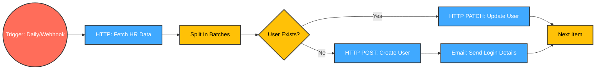
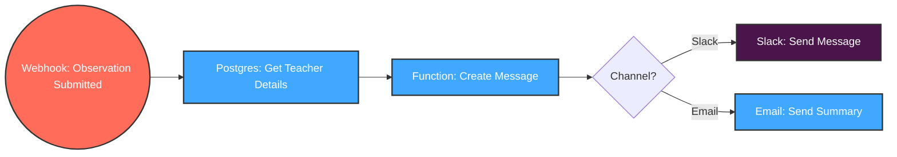
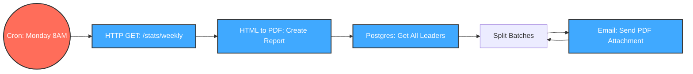
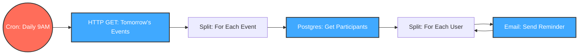
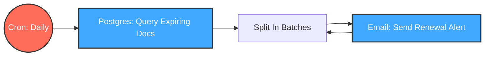
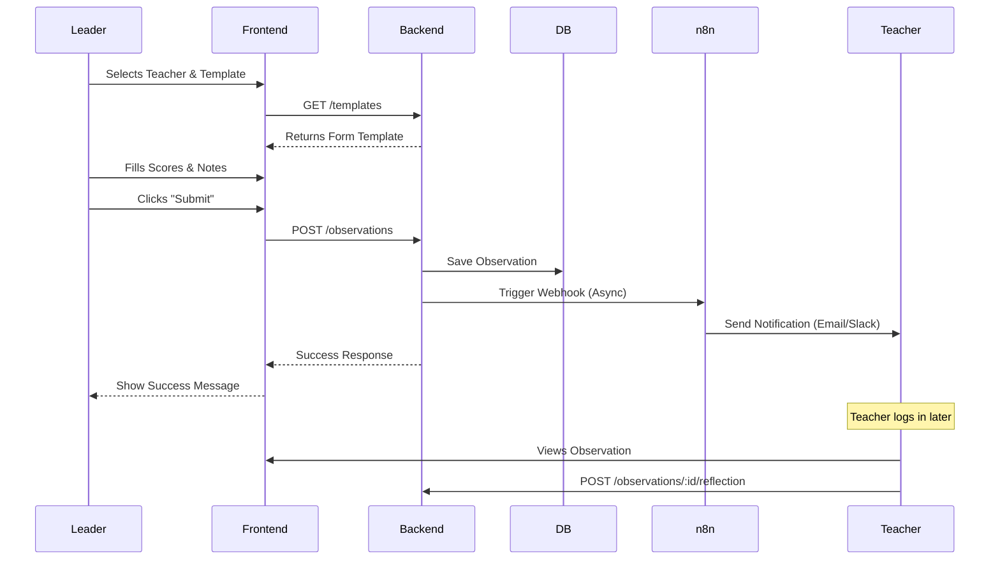
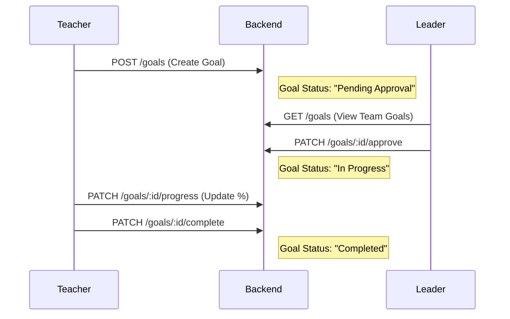
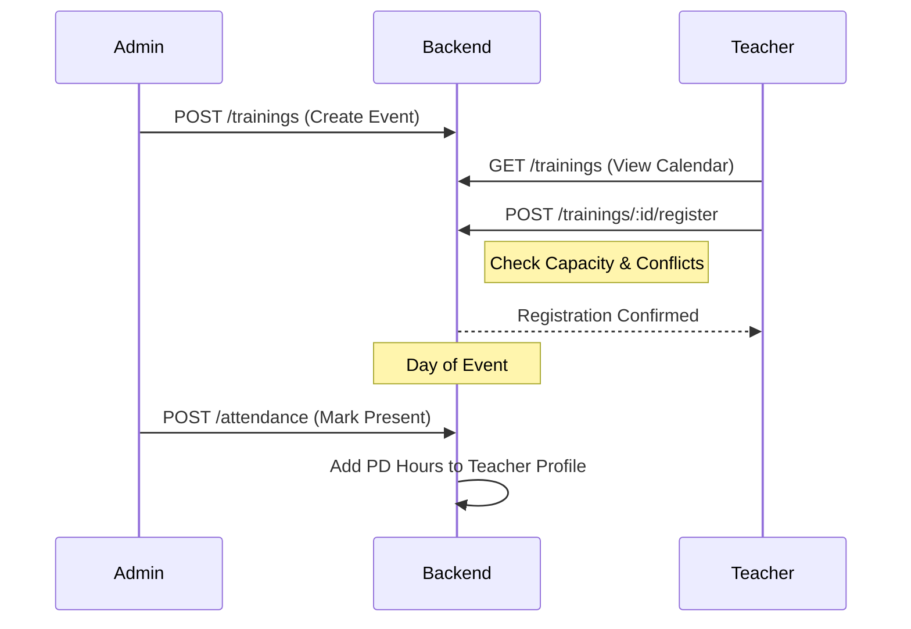
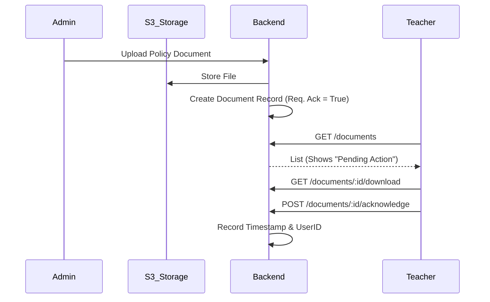

# n8n Workflow & Project Architecture Diagrams

This document visualizes the automation workflows and internal project logic using **Mermaid** diagrams. You can view these diagrams in any Markdown viewer that supports Mermaid (like GitHub, GitLab, VS Code, or Notion).

---

## Part 1: n8n Automation Workflows
*These diagrams represent the node-based flow you should build in n8n. Each box represents a Node.*

### 1. User Onboarding & Sync
**Goal**: Sync employees from HR System (e.g., Darwinbox) to School Growth Hub automatically.

### 2. Observation Feedback Loop
**Goal**: Notify teachers immediately upon submission of an observation.

### 3. Weekly Leadership Reports
**Goal**: Email statistics summary to leaders every Monday morning.

### 4. Training Session Reminders
**Goal**: Remind attendees 24 hours before a training event.

### 5. Document Expiry Alerts
**Goal**: Alert users when their uploaded certifications are about to expire.

---

## Part 2: Project Module Flows (Sequence Diagrams)
*These diagrams show the interaction between Users, the Frontend, and the Backend logic.*

### 1. Observation Process Flow
**Actors**: Leader (Observer), Teacher (Observee)

### 2. Professional Development (PD) Goals Flow
**Actors**: Teacher, Leader

### 3. Training Event Registration Flow
**Actors**: Admin, Teacher

### 4. Document Management & Acknowledgement
**Actors**: Admin, Teacher

